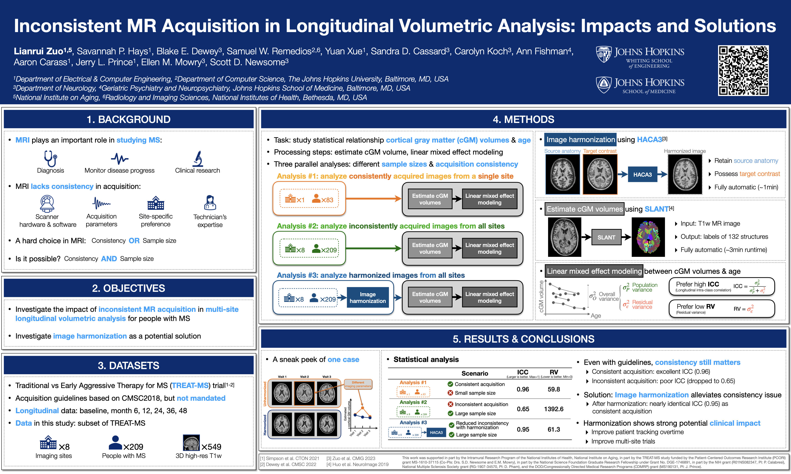

# Inconsistent MR Acquisition in Longitudinal Volumetric Analysis: Impacts and Solutions | [Abstract](https://cmsc.confex.com/cmsc/2023/meetingapp.cgi/Paper/8967)

- Citation:
    ```bibtex
      @article{Zuo_CMSC2023,
      title = {Inconsistent MR Acquisition in Longitudinal Volumetric Analysis: Impacts and Solutions},
      journal = {International Journal of Multiple Sclerosis Care},
      volume = {25},
      issue = {Suppl. 1},
      pages = {12-13},
      author = {Lianrui Zuo and Savannah P. Hays and Blake E. Dewey and Samuel W. Remedios and
                Yuan Xue and Sandra D. Cassard and Carolyn Koch and Ann Fishman and Aaron Carass and
                Jerry L. Prince and Ellen M. Mowry and Scott D. Newsome}
      }
    ```
- Contact: [Lianrui Zuo](lr_zuo@jhu.edu) *Department of Electrical and Computer Engineering, The Johns Hopkins University*

- Learn more about our harmonization technique HACA3: [project page](https://github.com/lianruizuo/haca3)
